# Настройка SQL Server для отправки email писем

## Оглавление

* [Описание](#Описание)

* [Подготовка сервера](#Подготовка-сервера)

* [Создание аккаунта](#Создание-аккаунта)

* [Создание профиля](#Создание-профиля)

* [Добавляем аккаунт в профиль](#Добавление-аккаунта-в-профиль)

* [Предоставление разрешения на использование профиля](#Предоставление-разрешения-на-использование-профиля)

* [Проверяем отправку email сообщения](#Проверяем-отправку-email-сообщения)

* [Удаление](#Удаление)

* [Альтернативный вариант](#Альтернативный-вариант)

## Описание

В этой статье будет разобран один из способов настройки SQL Server для отправки email
 уведомление. Для этого нам понадобятся следующие "компоненты":

  1. SQL Server
  2. Microsoft SQL Server Management Studio
  2. Доступ к SQL серверу с ролью администратора
  3. SMTP сервер
  4. Данные для подключения к SMTP серверу

Если у вас возникли проблемы на каких-либо этапах, обратитесь за помощью к вашим специалистам, устраните ошибки и продолжайте дальше.

## Подготовка сервера

Проверим текущее состояние сервис-брокера, выполнив запрос:

```sql
USE master

SELECT   name
        ,database_id
        ,is_broker_enabled
FROM	sys.databases
WHERE	name = 'msdb'
```
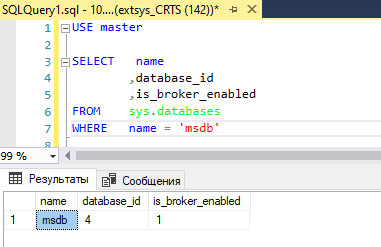


Если в поле `is_broker_enabled` указано значение `0`, то выполним следующий запрос:

```sql
ALTER DATABASE msdb SET ENABLE_BROKER WITH ROLLBACK IMMEDIATE;
```
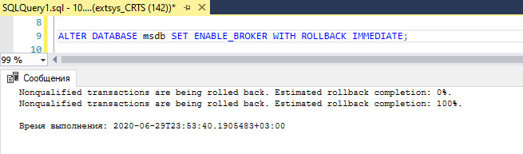

Операция должна выполниться без ошибок, а результат предыдущего запроса должен показать `1` в поле `is_broker_enabled`

Включаем опцию `DatabaseMail XPs` через системную процедуру `sp_configure`, выполнив следующий запрос:

```sql
GO
sp_configure 'show advanced', 1     -- Включаем расширенное отображение списка конфигурации
RECONFIGURE
GO
sp_CONFIGURE 'Database Mail XPs', 1 -- включаем опцию использования email
RECONFIGURE
```
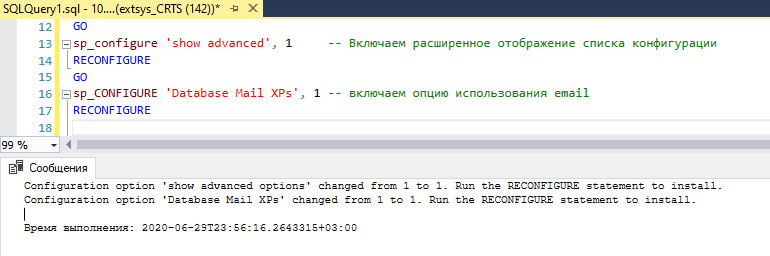

Запрос должен выполниться без ошибок. Для проверки включения опций необходимо выполнить процедуру `sp_configure
`:

```sql
GO
sp_configure @configname = 'show advanced'
GO
sp_configure @configname = 'Database Mail XPs'
```

Проверяем, что для каждой из конфигураций, поля `config_value` и `run_value` имеют значение `1`.  
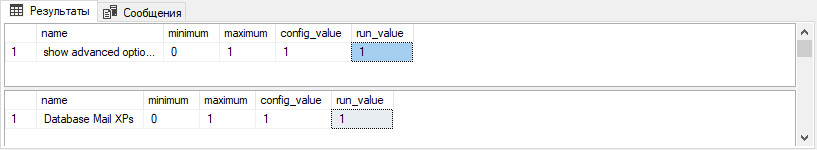

## Создание аккаунта

Для создания аккаунта используется процедура `sysmail_add_account_sp`. Процедура `sysmail_add_account_sp` имеет гораздо больше параметров, включая порт сервера, логин, пароль и т.д. Узнать подробнее можно по ссылке [sysmail_add_account_sp](https://docs.microsoft.com/ru-ru/sql/relational-databases/system-stored-procedures/sysmail-add-account-sp-transact-sql?view=sql-server-ver15)

Выполним следующий запрос для создания аккаунта:
```sql
-- Формируем переменные для аккаунта
DECLARE @account_name varchar(100) = 'test_account';
DECLARE @description varchar(100) = 'test account description'
DECLARE @email_address varchar(100) = (SELECT CAST(CONNECTIONPROPERTY('local_net_address') AS varchar) + '@SQLServer');
DECLARE @display_name varchar(100) = (SELECT 'test message '+ CAST(CONNECTIONPROPERTY('local_net_address') AS varchar) +' server');
DECLARE @mailserver_name varchar(100) = '10.30.1.58'

-- Создание аккаунта
EXECUTE msdb.dbo.sysmail_add_account_sp
    @account_name = @account_name,          -- Название аккаунта
    @description = @description,            -- Описание аккаунта
    @email_address = @email_address,	    -- Адрес отправителя
    @replyto_address = @email_address,	    -- Адрес для ответа на сообщения
    @display_name = @display_name,          -- Отображаемое имя отправителя в сообщении
    @mailserver_name = @mailserver_name;    -- Адрес SMTP сервера
```

Запрос на создание аккаунта должен выполниться без ошибок.  
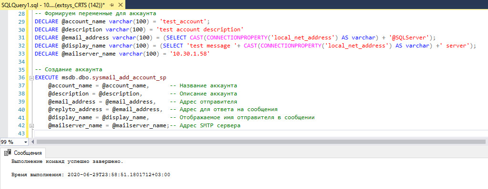

## Создание профиля

Для создания профиля используется процедура `msdb.dbo.sysmail_add_profile_sp
`. Подробнее о процедуре создания профиля [sysmail_add_profile_sp](https://docs.microsoft.com/vi-vn/sql/relational-databases/system-stored-procedures/sysmail-add-profile-sp-transact-sql?view=sql-server-2017)

Выполним следующий запрос, который создаст для нас профиль
```sql
-- Формируем переменные для профиля
DECLARE @profile_name varchar(100) = 'test_profile';
DECLARE @description varchar(255) = 'test profile description'

-- Создание профиля
EXECUTE msdb.dbo.sysmail_add_profile_sp
    @profile_name = @profile_name,	-- Название профиля
    @description = @description;	-- Описание профиля
```

Запрос на создание аккаунта должен выполниться без ошибок.  
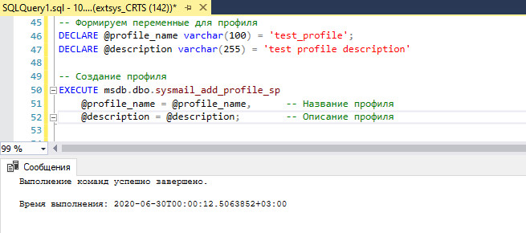

## Добавление аккаунта в профиль

Далее необходимо добавить аккаунт в профиль, для этого будем использовать процедуру `msdb.dbo
.sysmail_add_profileaccount_sp`. Подробнее о процедуре добавления аккаунта к профилю [sysmail_add_profileaccount_sp
](https://docs.microsoft.com/ru-ru/sql/relational-databases/system-stored-procedures/sysmail-add-profileaccount-sp-transact-sql?view=sql-server-ver15)

Выполним следующий запрос, который добавит аккаунт в профиль
```sql
-- Формируем переменные для профиля
DECLARE @profile_name varchar(100) = 'test_profile';
DECLARE @account_name varchar(100) = 'test_account';
DECLARE @sequence_number int = 1;

-- Добавляем аккаунт в профиль
EXECUTE msdb.dbo.sysmail_add_profileaccount_sp
    @profile_name = @profile_name,          -- Название профиля	
    @account_name = @account_name,          -- Название аккаунта
    @sequence_number = @sequence_number;    -- Порядковый номер аккаунта в профиле
```

`@sequence_number` - порядковый номер аккаунта в профиле, так как наш профиль новый, то добавляемый аккаунт будет под номером `1`.

Запрос на создание аккаунта должен выполниться без ошибок.  
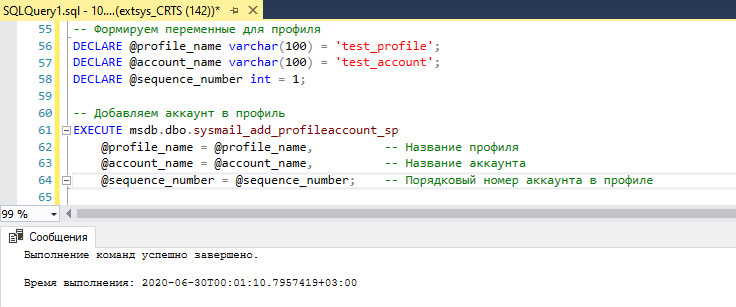

## Предоставление разрешения на использование профиля

Для предоставления разрешения на использование профиля используется процедура `msdb.dbo.sysmail_add_principalprofile_sp. 
Публичный профиль доступен для всех пользователей в базе данных `msdb`, хотя пользователи также должны быть членами роли DatabaseMailUserRole для выполнения sp_send_dbmail. 
Подробнее о процедуре предоставления прав профилю [sysmail_add_principalprofile_sp](https://docs.microsoft.com/ru-ru/sql/relational-databases/system-stored-procedures/sysmail-add-principalprofile-sp-transact-sql?view=sql-server-ver15)

Выполним следующий запрос, который сделает профиль открытым (публичным)
```sql
-- Формируем переменные для профиля
DECLARE @profile_name varchar(100) = 'test_profile';
DECLARE @principal_name varchar(100) = 'public';
DECLARE @is_default int = 1;

-- Делаем профиль публичным
EXECUTE msdb.dbo.sysmail_add_principalprofile_sp
    @profile_name = @profile_name,          -- Название профиля
    @principal_name = @principal_name,      -- Статус профиля
    @is_default = @is_default;              -- Профиль по умолчанию
```

Запрос на создание аккаунта должен выполниться без ошибок.  
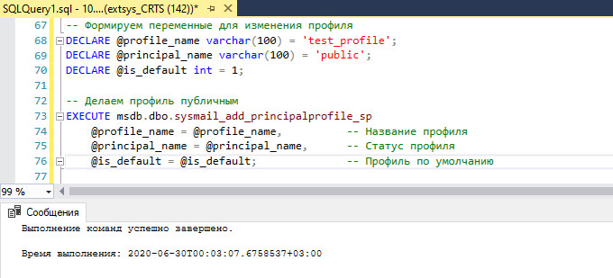

## Проверяем отправку email сообщения

Для отправки писем используется процедура `sp_send_dbmail`, подробнее о процедуре [sp_send_dbmail](https://docs.microsoft.com/ru-ru/sql/relational-databases/system-stored-procedures/sp-send-dbmail-transact-sql?view=sql-server-ver15).  
Мы используем минимальный набор для тестирования и выполним следующий запрос:

```sql
-- Отправляем email сообщение
EXEC  msdb.dbo.sp_send_dbmail
    @Profile_name = 'test_profile',                 -- Название профиля
    @Recipients   = 'vladislav.zagoskin@rt.ru',     -- Адресаты через ;
    @body = 'Тестовое письмо',                      -- Тело письма
    @body_format = 'TEXT',                          -- Формат тела письма
    @Subject = 'Проверка';                          -- Тема письма
```
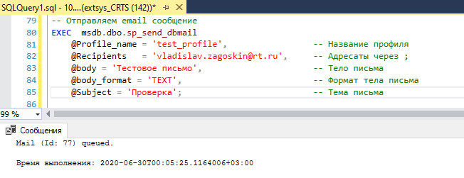

Результатом должно быть присланное сообщение на указанную почту:

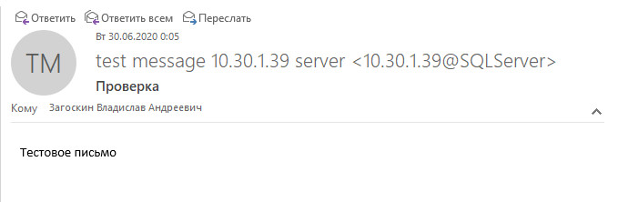

## Удаление

Чтобы удалить аккаунт из профиля, можно выполнить процедуру `sysmail_delete_profileaccount_sp
` с указанием профиля и аккаунта:

```sql
EXECUTE msdb.dbo.sysmail_delete_profileaccount_sp
    @profile_name = 'test_profile',
    @account_name = 'test_account'
```

Для удаления аккаунта можно воспользоваться процедурой `sysmail_delete_account_sp` с указанием имени аккаунта:

```sql
EXECUTE msdb.dbo.sysmail_delete_account_sp
    @account_name = 'test_account'
```

Для удаления профиля можно воспользоваться процедурой `sysmail_delete_profile_sp` с указанием имени профиля:

```sql
EXECUTE msdb.dbo.sysmail_delete_profile_sp
    @profile_name = 'test_profile'
```

## Альтернативный вариант

SQL Server предоставляет UI интерфейс для настройки отправки email
 писем, для этого нужно подключиться к серверу и в обозревателе объектов найти пункт `Компоненты Database Mail` и запустить его.

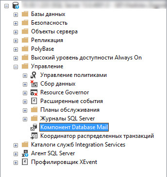

Откроется интерфейс для настройки.
