# Практическое руководство по работе с полями XML в MS SQL

Для работы с XML полями используются методы SQL Server. Все эти методы описаны в официальном [руководстве Microsoft](https://docs.microsoft.com/ru-ru/sql/t-sql/xml/xml-transact-sql?view=sql-server-2017). Так же есть хорошее описание на сайте [sql-tutorial.ru](http://www.sql-tutorial.ru/ru/book_xml_data_type_methods.html).

Мы разберем практические примеры в рамках WebTutor. По мере возможности и появления новых кейсов статья будет обновляться и обогащаться примерами.

## Оглавление

* [Вступление](#Вступление)
* [Метод query](#Метод-query)
    * [Получаем первый XML элемент по его имени](#получаем-первый-XML-элемент-по-его-имени)
    * [Получаем все XML элементы по имени](#Получаем-все-XML-элементы-по-имени)
    * [Получаем элемент со всем его содержимым](#Получаем-элемент-со-всем-его-содержимым)
    * [Получаем XML элемент по номеру родителя](#Получаем-XML-элемент-по-номеру-родителя)
    * [Получаем XML элемент по значению его вложенного элемента](#Получаем-XML-элемент-по-значению-его-вложенного-элемента)
    * [Получаем XML элемент по значению соседнего XML элемента](#Получаем-XML-элемент-по-значению-соседнего-XML-элемента)
* [Метод value](#Метод-value)
    * [Получаем значение XML элемента](#Получаем-значение-XML-элемента)
    * [Получаем значение соседнего XML элемента](#Получаем-значение-соседнего-XML-элемента)
    * [Получаем значения нескольких соседних элементов XML](#Получаем-значения-нескольких-соседних-элементов-XML)
    * [Получаем последний дочерний элемент XML элемента](#Получаем-последний-дочерний-элемент-XML-элемента)
    * [Использование агрегации для значений XML элементов](#Использование-агрегации-для-значений-XML-элементов)
* [Метод exist](#Метод-exist)
    * [Проверяем XML элемент](#Проверяем-XML-элемент)
    * [Проверяем равенство значения XML элемента с нашим значением](#Проверяем-равенство-значения-XML-элемента-с-нашим-значением)
    * [Проверяем, содержит ли значение XML элемента подстроку](#Проверяем,-содержит-ли-значение-XML-элемента-подстроку)
    * [Проверяем значение кастомного поля в WebTutor](#Проверяем-значение-кастомного-поля-в-WebTutor)
* [Метод nodes](#Метод-nodes)
    * [Разделяем по разным строкам каждый найденный XML элемент](#Разделяем-по-разным-строкам-каждый-найденный-XML-элемент)
    * [Получаем порядковые номера XML элементов на одном уровне](#Получаем-порядковые-номера-XML-элементов-на-одном-уровне)
* [Метод modify](#Метод-modify)
    * [insert](#insert)
        * [Добавляем XML элемент в документ](#Добавляем-XML-элемент-в-документ)
        * [Добавляем XML элемент на указанную позицию](#Добавляем-XML-элемент-на-указанную-позицию)
    * [delete](#delete)
        * [Удаляем XML элемент с его содержимым](#Удаляем-XML-элемент-с-его-содержимым)
    * [replace value of](#replace-value-of)
        * [Изменить значение элемента](#Изменить-значение-элемента)
* [Сборник задач SQL](#Сборник-задач-SQL)
    * [Заменяем значения элемента значением из переменной](#Заменяем-значения-элемента-значением-из-переменной)
    * [Заменяем значения элемента значением из другого поля](#Заменяем-значения-элемента-значением-из-другого-поля)
    * [Собираем значения нескольких полей в одном поле по ключу](#Собираем-значения-нескольких-полей-в-одном-поле-по-ключу)
    * [Получение полной иерархии подразделений](#Получение-полной-иерархии-подразделений)
    * [Получение иерархии подразделений вниз, начиная с конкретного подразделения](#Получение-иерархии-подразделений-вниз-начиная-с-конкретного-подразделения)
    * [Получаем список подразделений по иерархии вверх, включая само подразделение](#Получаем-список-подразделений-по-иерархии-вверх-включая-само-подразделение)
    * [Получаем значения XML узлов и собираем в строку через разделитель](#Получаем-значения-XML-узлов-и-собираем-в-строку-через-разделитель)
## Вступление

Для работы с XML документом в T-SQL используются следующие методы:

* **query**
* **value**
* **exist**
* **nodes**
* **modify**

Пример XML документа:
```xml
<collaborator SPXML-FORM="x-local://wtv/wtv_collaborator.xmd"> // корневой элемент
    <email>test@ts.ru</email> // дочерний элемент
    <custom_elems>
        <custom_elem>
            <name>field1</name>
            <value>1</value>
        </custom_elem>
    </custom_elems>
</collaborator>
```

**Нумерация элементов в XML документах начинается с 1.**

В методах для поиска элемента используются языки запросов `XPath` или `XQuery`.

## Метод query

Метод `query` используется для извлечения XML элементов. Метод возвращает результат в виде XML.
```sql
data.query('XPath')
```

Метод возвращает все найденные элементы последовательно.

XML документ для работы с примерами ниже:
```xml
<collaborator SPXML-FORM="x-local://wtv/wtv_collaborator.xmd">
    <id>6732345728573339018</id>
    <lastname>Загоскин</lastname>
    <access>
        <access_level>0</access_level>
        <access_role>user</access_role>
        <is_arm_admin>0</is_arm_admin>
        <web_banned>0</web_banned>
        <is_content_admin>0</is_content_admin>
    </access>
    <custom_elems>
        <custom_elem>
            <name>field1</name>
            <value>1</value>
        </custom_elem>
        <custom_elem>
            <name>field2</name>
            <value>value</value>
        </custom_elem>
        <custom_elem>
            <name>field3</name>
            <value>123456</value>
        </custom_elem>
    </custom_elems>
</collaborator>
```

### Получаем первый XML элемент по его имени

Найдем первый элемент с именем `lastname`.

Запрос:
```sql
SELECT  data.query('(/collaborator/lastname)[1]')
FROM    collaborator
```

В результате получим первый элемент `lastname` со всем его содержимым. Номер элемента для получения задается `[1]`.  
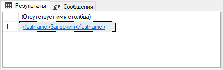

### Получаем все XML элементы по имени

Найдем все элементы с именем `name`. В нашем документе всего три тега с таким именем и все они вложены в разные элементы `custom_elem`.

Запрос:
```sql
SELECT  data.query('(/collaborator/custom_elems/custom_elem/name)')
FROM    collaborator
```

В результате получим все найденные элементы по указанному пути, так как мы не указали номер элемента, который нам нужен.  
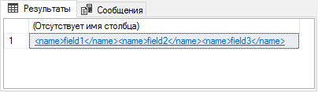

### Получаем элемент со всем его содержимым

Найдем элементы кастомных полей с его родителем. Кастомные поля хранятся в элементах с именем `custom_elem`, корневой элемент для которых `custom_elems`.

Запрос:
```sql
SELECT  data.query('(/collaborator/custom_elems)')
FROM    collaborator
```

В результате получим элемент `custom_elems` со всеми вложенными элементами:  
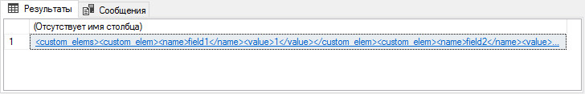

```xml
<custom_elems>
    <custom_elem>
        <name>field1</name>
        <value>1</value>
    </custom_elem>
    <custom_elem>
        <name>field2</name>
        <value>value</value>
    </custom_elem>
    <custom_elem>
        <name>field3</name>
        <value>123456</value>
    </custom_elem>
</custom_elems>
```

### Получаем XML элемент по номеру родителя

Найдем элемент `name` из второго элемента `custom_elem`. Для этого используем явное указание номера элемента.

Запрос:
```sql
SELECT  data.query('(collaborator/custom_elems/custom_elem[2]/name)')
FROM    collaborator
```

В результате получим элемент `name` из второго по счету элемента `custom_elem`:  
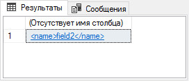

### Получаем XML элемент по значению его вложенного элемента

Найдем элемент `custom_elem` в котором содержится элемент `name` со значением `field3`.

Запрос:
```sql
SELECT  data.query('(/collaborator/custom_elems/custom_elem[name="field3"])[1]')
FROM    collaborator
```

Конструкция `...custom_elem[name="field3"]...` ищет элемент `custom_elem` в котором находится элемент `name
` со значением `field3` и возвращает найденный элемент `custom_elem`:  
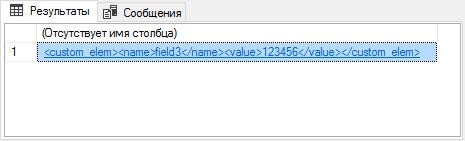

### Получаем XML элемент по значению соседнего XML элемента

Найдем элемент `value`, который находится в элементе `custom_elem`, где вложенный элемент `name` имеет значение `field3`.

Запрос:
```sql
SELECT  data.query('(/collaborator/custom_elems/custom_elem[name="field3"]/value)[1]')
FROM    collaborator
```

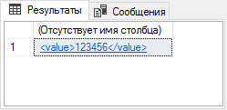

## Метод value

Метод `value` извлекает значение элемента с указанием типа данных. При невозможности преобразовать данные в нужный тип — сервер выкидывает ошибку. Нужно явно указывать номер элемента, за исключением использования оператора точка `'.'` - выбрать все содержимое.
```sql
data.query('XPath', 'DataType')
```

XML документ для работы с примерами ниже:
```xml
<collaborator SPXML-FORM="x-local://wtv/wtv_collaborator.xmd">
    <id>6732345728573339018</id>
    <lastname>Загоскин</lastname>
    <birth_date>1988-06-02T00:00:00+00:00</birth_date>
    <is_dismiss>0</is_dismiss>
    <history_states>
        <history_state>
            <id>piheqc</id>
            <state_id>vacation</state_id>
            <start_date>2019-09-22T10:05:00+00:00</start_date>
            <finish_date>2019-09-24T10:05:00+00:00</finish_date>
        </history_state>
        <history_state>
            <id>pfejq7</id>
            <state_id>В</state_id>
            <start_date>2019-09-26T10:10:41+00:00</start_date>
            <finish_date>2019-09-30T10:10:41+00:00</finish_date>
        </history_state>
    </history_states>
    <custom_elems>
        <custom_elem>
            <name>message_sent</name>
            <value>1</value>
        </custom_elem>
        <custom_elem>
            <name>date_sending_message</name>
            <value>2019-06-02T15:00:00+00:00</value>
        </custom_elem>
        <custom_elem>
            <name>message_subject</name>
            <value>birth_day</value>
        </custom_elem>
    </custom_elems>
</collaborator>
```

### Получаем значение XML элемента

Найдем значения элементов с основными данными сотрудника (ИД, фамилию, дату рождения и флаг уволен сотрудник или нет).

Запрос:
```sql
SELECT   data.value('(/collaborator/id)[1]', 'bigint') AS id
        ,data.value('(/collaborator/lastname)[1]', 'varchar(40)') AS lastname
        ,data.value('(/collaborator/birth_date)[1]', 'date') AS birth_date
        ,data.value('(/collaborator/is_dismiss)[1]', 'bit') AS is_dismiss
FROM    collaborator
```

В результате получим таблицу с данными о сотруднике:  
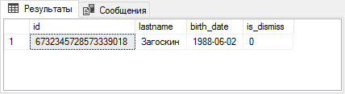

Для примера, если мы попытаемся указать для поля `lastname` тип данных `date`, то получим ошибку:  
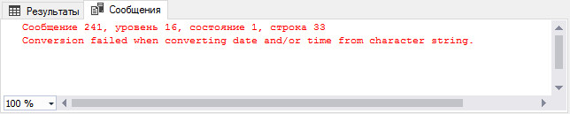

### Получаем значение соседнего XML элемента

Найдем значения кастомных полей с именами `message_sent`, `date_sending_message` и `message_subject
`, используя значения их соседних элементов `name`.

Запрос:
```sql
SELECT   data.value('(/collaborator/custom_elems/custom_elem[name="message_sent"]/value)[1]', 'bit') AS message_sent
        ,data.value('(/collaborator/custom_elems/custom_elem[name="date_sending_message"])[1]/value[1]', 'datetime') AS date_sending_message
        ,data.value('(/collaborator/custom_elems/custom_elem[name="message_subject"]/value)[1]', 'varchar(50)') AS message_subject
FROM    collaborator
```

В результате получим следующее:  
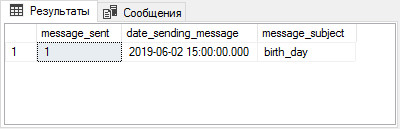

Конструкция `...custom_elem[name="message_sent"]/value...` ищет элемент с именем `custom_elem
`, в который вложен тег `name` со значением `message_sent`. Дальше мы добавляем `/value` - то есть в найденном элементе `custom_elem` с вложенным элементом `<name>message_sent</name>` обращаемся к элементу `<value>...</value>` и получаем его значение. На самом деле `name` и `value` это всего лишь имена вложенных тегов. В следующем примере это будет показано наглядно.

### Получаем значения нескольких соседних элементов XML

Найдем из списка состояний сотрудника `history_states` состояние `history_state` поле `state_id` которого имеет значение `vacation` и выведем значения элементов `start_date` и `finish_date` в формате даты.

Запрос:
```sql
SELECT   data.value('(/collaborator/history_states/history_state[state_id="vacation"]/start_date)[1]', 'date') AS start_date
        ,data.value('(/collaborator/history_states/history_state[state_id="vacation"]/finish_date)[1]', 'date') AS finish_date
FROM    collaborator
```

В результате получим следующее:  
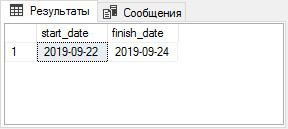

### Получаем последний дочерний элемент XML элемента

Найдем данные о последнем совершенном действии `workflow_log_entry
` из истории вызова действий документооборота в карточке заявки. Для этой задачи мы используем документ XML заявки, где содержится история переходов с одного этапа на другой.

XML документ для работы с примерами ниже:
```xml
<request SPXML-FORM="x-local://wtv/wtv_request.xmd">
    <code>ir41835</code>
    <request_type_id>335113325541453322</request_type_id>
    <workflow_log_entrys>
        <workflow_log_entry>
            <create_date>2019-10-04T10:55:13+00:00</create_date>
            <person_id>6732345728573339018</person_id>
            <person_fullname>Загоскин Владислав Андреевич</person_fullname>
            <begin_state>st_6</begin_state>
            <finish_state>st_9</finish_state>
            <workflow_time_spent_minutes>0</workflow_time_spent_minutes>
        </workflow_log_entry>
        <workflow_log_entry>
            <create_date>2019-10-04T11:55:16+00:00</create_date>
            <person_id>6732345728573339018</person_id>
            <person_fullname>Загоскин Владислав Андреевич</person_fullname>
            <begin_state>st_6</begin_state>
            <finish_state>st_11</finish_state>
            <workflow_time_spent_minutes>60</workflow_time_spent_minutes>
        </workflow_log_entry>
        <workflow_log_entry>
            <create_date>2019-10-04T11:57:20+00:00</create_date>
            <person_id>6732345728573339018</person_id>
            <person_fullname>Загоскин Владислав Андреевич</person_fullname>
            <begin_state>st_6</begin_state>
            <finish_state>st_3</finish_state>
            <workflow_time_spent_minutes>2</workflow_time_spent_minutes>
        </workflow_log_entry>
    </workflow_log_entrys>
</request>
```

Сложность данного примера заключается в том, что для каждого родительского элемента `workflow_log_entrys` может быть разное количество дочерних элементов `workflow_log_entry`, по этому мы не знаем какой порядковый номер у нужного нам элемента. Используем функцию `last()`, которая извлекает последний дочерний элемент.

Запрос:
```sql
SELECT   data.value('(/request/workflow_log_entrys/workflow_log_entry[last()]/create_date)[1]', 'date') AS create_date
        ,data.value('(/request/workflow_log_entrys/workflow_log_entry[last()]/person_id)[1]', 'bigint') AS person_id
        ,data.value('(/request/workflow_log_entrys/workflow_log_entry[last()]/person_fullname)[1]', 'varchar(50)') AS person_fullname
        ,data.value('(/request/workflow_log_entrys/workflow_log_entry[last()]/begin_state)[1]', 'varchar(10)') AS begin_state
        ,data.value('(/request/workflow_log_entrys/workflow_log_entry[last()]/finish_state)[1]', 'varchar(10)') AS finish_state
FROM    collaborator
```

Функция `last()` находит последний дочерний элемент с наименованием `workflow_log_entry`. В результате получим:  
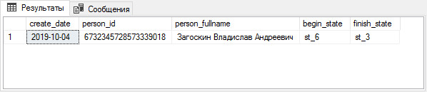

Для получения предпоследнего элемента можно использовать запись вида `../workflow_log_entry[last() - 1/..]`

### Использование агрегации для значений XML элементов

Найдем время, которое заявка находилась на всех этапах документооборота. Для каждой записи истории `workflow_log_entry` существует вложенный элемент `workflow_time_spent_minutes`, где хранится время в минутах, которое заявка провела на этапе. Применим агрегирующие функции `sum` и `count`

Запрос:
```sql
SELECT   data.value('sum(/request/workflow_log_entrys/workflow_log_entry/workflow_time_spent_minutes)','int') AS full_time_minuts
        ,data.value('count(/request/workflow_log_entrys/workflow_log_entry/workflow_time_spent_minutes)','int') AS count_full_time_minuts
FROM    collaborator
```

В результате получим:  
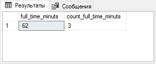

## Метод exist

Метод `exist` проверяет существование указанного выражения `XPath`. Всегда возвращает 0 или 1.

```sql
data.exist('XPath')
```

XML документы для работы с примерами ниже (3 документа):
```xml
<collaborator SPXML-FORM="x-local://wtv/wtv_collaborator.xmd">
    <code>332233</code>
    <lastname>Загоскин 0</lastname>
    <custom_elems>
        <custom_elem>
            <name>message_sent</name>
            <value>1</value>
        </custom_elem>
    </custom_elems>
</collaborator>
```

```xml
<collaborator SPXML-FORM="x-local://wtv/wtv_collaborator.xmd">
    <code>332233</code>
    <lastname>Загоскин 1</lastname>
    <password>123456</password>
    <custom_elems>
        <custom_elem>
            <name>message_sent</name>
            <value>0</value>
        </custom_elem>
    </custom_elems>
</collaborator>
```

```xml
<collaborator SPXML-FORM="x-local://wtv/wtv_collaborator.xmd">
    <code>332233</code>
    <lastname>Загоскин 2</lastname>
    <password/>
    <custom_elems>
        <custom_elem>
            <name>message_sent</name>
        </custom_elem>
    </custom_elems>
</collaborator>
```

### Проверяем XML элемент

Проверим существование XML элемента в документах - `password`.

Запрос:
```sql
SELECT   data.value('(/collaborator/lastname)[1]','varchar(50)') AS lastname
        ,data.value('(/collaborator/password)[1]','varchar(50)') AS password
        ,data.exist('(/collaborator/password)') AS exist_password
FROM    collaborator
WHERE   data.exist('(/collaborator/password)') = 1
```

Для наглядности вынесли метод `exist` в `SELECT`. В результате получим все строки, для которых `exist` вернул `1`:  
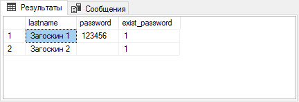

Обратите внимание, на документ с фамилией `Загоскин 2`, метод `exist` вернул `1`, так как поле существует, хотя не имеет значения.

### Проверяем равенство значения XML элемента с нашим значением

Найдем все строки с элементом `lastname` и его значение `Загоскин 1`.

Запрос:
```sql
SELECT   data.value('(/collaborator/lastname)[1]','varchar(50)') AS lastname
        ,data.exist('(/collaborator/lastname[text()="Загоскин 1"])') AS exist_lastname
FROM    collaborator
WHERE   data.exist('(/collaborator/lastname[text()="Загоскин 1"])') = 1
```

Функция `text()` возвращает значение элемента в виде текста. В результате получим:  
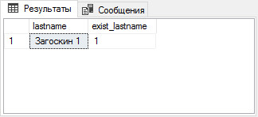

### Проверяем, содержит ли значение XML элемента подстроку

Найдем все строки, для которых значение элемента `lastname` содержит подстроку `скин 2`.

Запрос:
```sql
SELECT   data.value('(/collaborator/lastname)[1]','varchar(50)') AS lastname
        ,data.exist('/collaborator/lastname/text()[contains(., "скин 2")]') AS exist_lastname
FROM    collaborator
WHERE   data.exist('/collaborator/lastname/text()[contains(., "скин 2")]') = 1
```

В примере используется дополнительная конструкция `[contains(., "скин 2")]`. Функция `contains(str, substr)` проверяет, содержит ли строка `str` подстроку `substr`. Оператор `.` - возвращает все найденное содержимое предшествующему запросу `XPath` - значение элемента `lastname`.

В результате получим:  
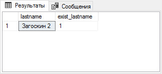

### Проверяем значение кастомного поля в WebTutor

Найдем все записи, где `custom_elem` содержит элементы `name` со значением `message_sent` и элемент `value` со значением `1`.
```sql
SELECT   data.value('(/collaborator/lastname)[1]','varchar(50)') AS lastname
        ,data.value('(/collaborator/custom_elems/custom_elem[name="message_sent"]/value)[1]','int') AS message_sent
        ,data.exist('/collaborator/custom_elems/custom_elem[name="message_sent"]/value[text() = 1]') AS exist_result
FROM    collaborator
WHERE   data.exist('/collaborator/custom_elems/custom_elem[name="message_sent"]/value[text() = 1]') = 1
```

В результате получим:  
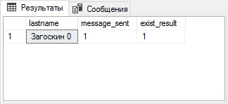

## Метод nodes

Метод `nodes` разбивает XML документ в соответствии с указанным выражением `XPath`, создавая при этом собственную псевдотаблицу из найденных XML элементов.

```sql
data.nodes('XPath') AS Table(field)
```

**Пример**. У нас есть XML документ со следующей структурой:
```xml
<root>
    <label>Макароны</label>
    <value>200 гр</value>
    <label>Фрукты</label>
    <value>400 гр</value>
    <label>Орехи</label>
    <value>100 гр</value>
</root>
```

Использование метода `nodes('root/value') AS Table1(field)` приведет к созданию псевдотаблицы `Table1
` и столбцом `field`, где каждая строка — это найденный элемент по выражению `Xpath`.  
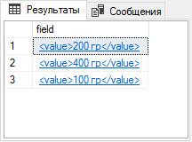

Метод используется в сочетании с другими методами или с оператором `CROSS APPLY`. Использование с оператором `CROSS APPLY` создаст эффект `LEFT JOIN` исходной строки со всеми найденными элементами (псевдотаблицей).

XML документ для работы с примерами ниже:
```xml
<collaborator SPXML-FORM="x-local://wtv/wtv_collaborator.xmd">
    <id>6732345728573339018</id>
    <lastname>Загоскин</lastname>
    <birth_date>1988-06-02T00:00:00+00:00</birth_date>
    <is_dismiss>0</is_dismiss>
    <custom_elems>
        <custom_elem>
            <name>message_sent</name>
            <value>1</value>
        </custom_elem>
        <custom_elem>
            <name>date_sending_message</name>
            <value>2019-06-02T15:00:00+00:00</value>
        </custom_elem>
        <custom_elem>
            <name>message_subject</name>
            <value>birth_day</value>
        </custom_elem>
    </custom_elems>
</collaborator>
```

### Разделяем по разным строкам каждый найденный XML элемент

Для каждого имеющегося элемента `custom_elem` в документе, выведем значения его дочерних элементов.

Так выглядит наш документ:  
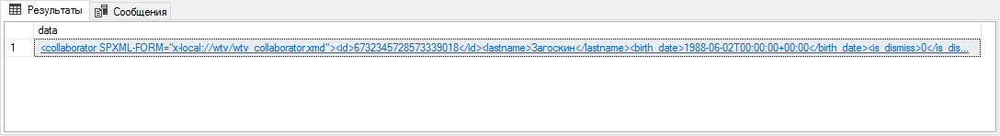

Выполним первый запрос:
```sql
SELECT  data.value('(/collaborator/id)[1]','bigint') AS id
        ,Table1.field.query('.') AS nodes_element
FROM    collaborator
        CROSS APPLY collaborator.data.nodes('(/collaborator/custom_elems/custom_elem)') AS Table1(field)
```

Получим три строки с каждым найденным `custom_elem`, оператор `.` в методе `query
` выведет все содержимое найденного элемента.  
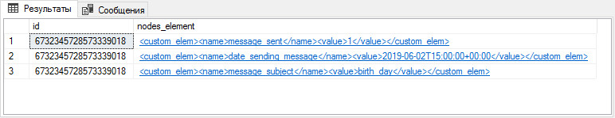

Добавим в запрос вывод дочерних элементов из каждого найденного:
```sql
SELECT   data.value('(/collaborator/id)[1]','bigint') AS id
        ,Table1.field.query('.') AS nodes_element
        ,Table1.field.query('name') AS nodes_name
        ,Table1.field.query('./value') AS nodes_value
FROM    collaborator
        CROSS APPLY collaborator.data.nodes('(/collaborator/custom_elems/custom_elem)') AS Table1(field)
```

Благодаря тому, что метод `nodes` возвращает свой собственный XML документ, мы можем обращаться к его содержимому относительного его.

В результате получим:  
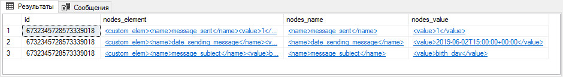

Для найденных элементов получим их значения:
```sql
SELECT   data.value('(/collaborator/id)[1]','bigint') AS id
        ,Table1.field.query('.') AS nodes_element
        ,Table1.field.query('name').value('.', 'varchar(100)') AS nodes_name
        ,Table1.field.value('(./value)[1]', 'varchar(100)') AS nodes_value
FROM    collaborator
        CROSS APPLY collaborator.data.nodes('(/collaborator/custom_elems/custom_elem)') AS Table1(field)
```

Мы получили желаемый результат, у нас есть название кастомного поля и его значение:  
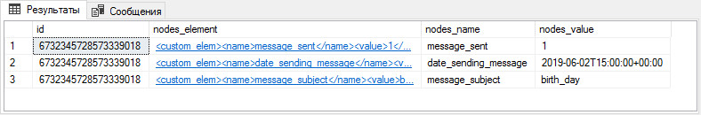

### Получаем порядковые номера XML элементов на одном уровне

Для получения порядковых номеров мы будем использовать метод `nodes` и его особенность, при которой элементы возвращаются в порядке их следования в XML документе. Получим порядковые номера всех кастомных полей `custom_elem`.

Запрос:
```sql
SELECT   id
        ,Table1.field.query('.') AS query
        ,Table1.field.value('count( for $s in (/collaborator/custom_elems/custom_elem) where $s << . return(.) ) + 1', 'int') AS node_number
        ,ROW_NUMBER() OVER (PARTITION BY id ORDER BY id) AS node_number_light
FROM    collaborator
        CROSS APPLY collaborator.data.nodes('(/collaborator/custom_elems/custom_elem)') AS Table1(field)
```

В методе `value` используется запрос `XQuery` и побитовая операция `<<`. Говоря простым языком, конструкция `count
( for $s in (/collaborator/custom_elems/custom_elem) where $s << . return(.) )` возвращает количество всех предшествующих элементов относительно текущего, возвращенного методом `nodes`.

То есть, для первого `custom_elem` нет предшествующих элементов, поэтому количество будет равно `0
`. Следующим метод `nodes` возвращает второй `custom_elem`, количество предшествующих элементов становится `1
` и так далее. Обратите внимание, путь до элемента в методе `nodes` полностью соответствует пути в запросе `XQuery`. Так как конструкция считает количество предшествующих элементов, то отсчет начинается с `0`. Так как функция `count` возвращает число, мы можем производить над возвращенным результатом математические операции.

Существует более простой способ получить порядковые номера элементов, можно использовать оконную функцию `ROW_NUMBER
`, которая легче в понимании и даёт аналогичный результат, но работает гораздо медленнее.

В результате получим таблицу:  
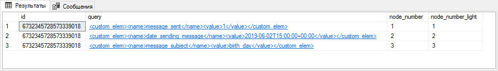

## Метод modify

Метод `modify` изменяет XML документ. Используется преимущественно в выражении `UPDATE
` и может за один раз изменить только одно значение.

Для метода существует 3 ключевых оператора:

* **[insert](#insert)**
* **[delete](#delete)**
* **[replace value of](#replace-value-of)**

Каждый оператор говорит сам за себя: вставка, удаление, замена значения.
```sql
data.modify('insert (<field>...</field>) into (XPath)')
data.modify('delete (XPath)')
data.modify('replace value of (XPath) with (value)')
```

XML документ для работы с примерами ниже:
```xml
<request SPXML-FORM="x-local://wtv/wtv_request.xmd">
    <id>6746470118585096417</id>
    <code>ir34122</code>
    <type>collaborator</type>
    <status_id>pay</status_id>
    <create_date>2019-01-15T09:12:06+00:00</create_date>
    <workflow_id>6746470118585096400</workflow_id>
    <workflow_state>st_11</workflow_state>
    <workflow_state_name>Передано в оплату</workflow_state_name>
    <is_workflow_init>1</is_workflow_init>
    <workflow_log_entrys>
        <workflow_log_entry>
            <create_date>2019-01-15T09:12:06+00:00</create_date>
            <action_id>act_5</action_id>
            <finish_state>st_1</finish_state>
            <submited>0</submited>
        </workflow_log_entry>
        <workflow_log_entry>
            <create_date>2019-05-28T09:54:34+00:00</create_date>
            <action_id>act_1</action_id>
            <person_id>6732345728573339018</person_id>
            <person_fullname>Загоскин Владислав Андреевич</person_fullname>
            <begin_state>st_1</begin_state>
            <finish_state>st_5</finish_state>
            <submited>1</submited>
        </workflow_log_entry>
    </workflow_log_entrys>
</request>
```

### **INSERT**

Оператор `insert` позволяет добавлять XML элементы. Имеет следующие вспомогательные операторы для уточнения места добавления:

* `{ as first || as last } into` - добавляет данные в элемент как дочерние, по умолчанию последним потомком, `as first into` добавит данные первым потомком.
* `after` - добавляет данные после указанного элемента.
* `before` - добавляет данные перед указанным элементом.

#### Добавляем XML элемент в документ

Добавим новый элемент `workflow_log_entry` в родительский `workflow_log_entrys`.
```sql
UPDATE  request
SET     data.modify('insert
                    <workflow_log_entry>
                      <create_date>2019-06-30T16:16:22+00:00</create_date>
                      <person_id>6732345728573339018</person_id>
                      <person_fullname>Гитлер Адольф</person_fullname>
                      <begin_state>st_4</begin_state>
                      <finish_state>st_3</finish_state>
                      <submited>1</submited>
                    </workflow_log_entry>
                    into
                    (request/workflow_log_entrys)[1]
        ')
WHERE   data.value('(request/id)[1]', 'bigint') = 6746470118585096417
/*
insert                            -- оператор
<workflow_log_entry>              -- добавляемый элемент xml
into                              -- указываем место для добавления
(request/workflow_log_entrys)[1]  -- путь до элемента для вставки
*/
```

В результате мы получим следующий XML документ:  
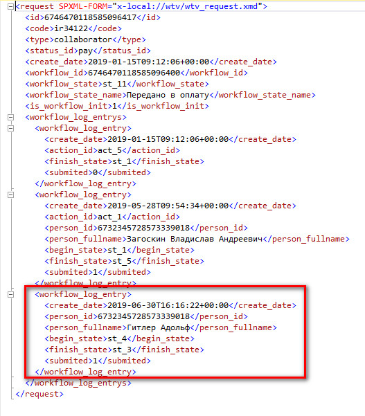

Оператор `into
` добавляет элементы последним потомком. Для точного указания места вставки используются ключевые слова `as first` и `as last`.
```sql
UPDATE  request
SET     data.modify('insert
                    <workflow_log_entry>
                      <create_date>2019-06-30T16:16:22+00:00</create_date>
                      <person_id>6732345728573339018</person_id>
                      <person_fullname>Загоскин Владислав Андреевич</person_fullname>
                      <begin_state>st_4</begin_state>
                      <finish_state>st_3</finish_state>
                      <submited>1</submited>
                    </workflow_log_entry>
                    as first into
                    (request/workflow_log_entrys)[1]
        ')
WHERE   data.value('(request/id)[1]', 'bigint') = 6746470118585096417
/*
insert                            -- оператор
<workflow_log_entry>              -- добавляемый элемент xml
as first into                     -- указываем место для добавления и явно говорим вставить первым потомком
(request/workflow_log_entrys)[1]  -- путь до элемента для вставки
*/
```

В результате мы получим следующий XML документ:  


#### Добавляем XML элемент на указанную позицию

В одном из `workflow_log_entry` элементов отсутствуют дочерние элементы `person_fullname`. Добавим его после элемента `create_date`.
```sql
DECLARE @fio varchar(100) = 'Загоскин Владислав Андреевич'

UPDATE  request
SET     data.modify('insert
                    <person_fullname>{ sql:variable("@fio") }</person_fullname>
                    after
                    (request/workflow_log_entrys/workflow_log_entry[1]/create_date)[1]
        ')
WHERE   data.value('(request/id)[1]', 'bigint') = 6746470118585096417
/*
insert                                      -- оператор
<person_fullname   >                        -- вставляемый элемент xml
{ sql:variable("@fio") }                    -- берем значение из переменной
after                                       -- добавляем после элемента create_date
(.../workflow_log_entry[1]/create_date)[1]  -- путь до элемента для вставки
*/
```

В результате получим документ:  
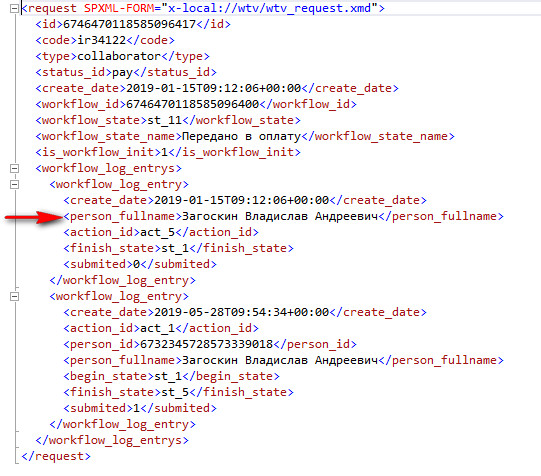

Мы могли использовать оператор `before` и в выражении `XPath` указать `request/workflow_log_entrys/workflow_log_entry[1]/action_id`.

Добавление значения из переменной `{ sql:variable("@fio") }` можно заменить на `{ sql:column("`*`fieldName`*`") }` - взять значение из определенного столбца строки.

### **DELETE**

Оператор `delete` удаляет часть XML документа найденного по выражению `XPath`.

#### Удаляем XML элемент с его содержимым

```sql
UPDATE  request
SET     data.modify('delete
                    (request/workflow_log_entrys[1])
        ')
WHERE   data.value('(request/id)[1]', 'bigint') = 6746470118585096417
/*
delete                            -- оператор
(request/workflow_log_entrys)     -- путь до элемента, который нужно удалить
*/
```

Без указания номера элемента `[1]` - будут удалены все найденные элементы.  
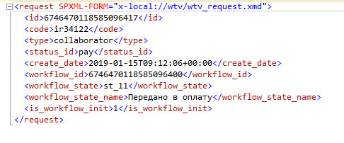

### **REPLACE VALUE OF**

Оператор `replace value of` изменяет содержимое элемента.

#### Изменить значение элемента

```sql
UPDATE  request
SET     data.modify('replace value of
                    (request/workflow_log_entrys/workflow_log_entry[last()]/person_fullname/text())[1]
                    with
                    "Далай Лама"
        ')
WHERE   data.value('(request/id)[1]', 'bigint') = 6746470118585096417
/*
replace value of                                            -- оператор
(.../workflow_log_entry[last()]/person_fullname/text())[1]  -- путь до элемента
with                                                        -- обязательное слово, часть оператора
"Далай Лама"                                               -- новое значение
*/
```

Для поиска мы использовали функцию `last()` - последний элемент. Функция `text()` указывает на изменение значения.

В результате получаем:  
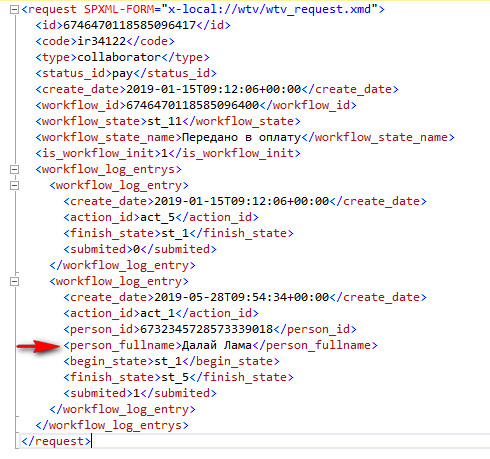

## Сборник задач SQL

В этом разделе находятся различные задачи связанные с манипулированием XML документов.

### Заменяем значения элемента значением из переменной

**Документ:**
```xml
<collaborator SPXML-FORM="x-local://wtv/wtv_request.xmd">
    <id>6746470118585096417</id>
    <code>34122</code>
    <email>test@mail.ru</email>
</collaborator>
```

**Запрос:**
```sql
DECLARE @sNewMail varchar(100) = 'replaced@mail.ru'

UPDATE  collaborator
SET     data.modify('replace value of
                    (collaborator/email/text())[1]
                    with
                    sql:variable("@sNewMail")
        ')
WHERE   data.value('(collaborator/id)[1]', 'bigint') = 6746470118585096417
```

**Результат:**  
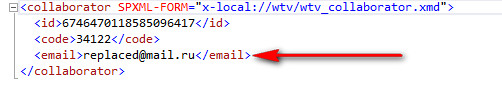

### Заменяем значения элемента значением из другого поля

**Документ:**

Таблица для примера состоит из 2 полей:  
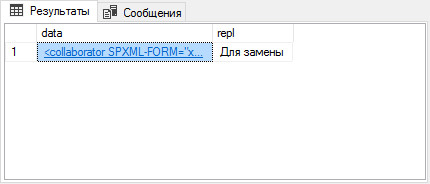

— где поле `data` содержит XML документ:
```xml
<collaborator SPXML-FORM="x-local://wtv/wtv_request.xmd">
    <id>6746470118585096417</id>
    <code>34122</code>
    <email>test@mail.ru</email>
</collaborator>
```

**Запрос:**
```sql
UPDATE  collaborator
SET     data.modify('replace value of
                    (collaborator/email/text())[1]
                    with
                    sql:column("repl")
        ')
WHERE   data.value('(collaborator/id)[1]', 'bigint') = 6746470118585096417
```

**Результат:**  
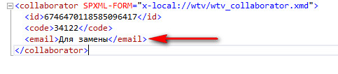

### Собираем значения нескольких полей в одном поле по ключу

**Документ:**

Таблица для примера:  
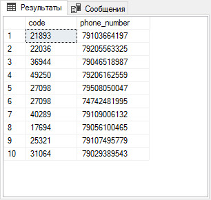

**Запрос:**
```sql
SELECT   code -- ключ
        ,RTrim(LTrim(SUBSTRING(phone_number, 2, 50))) AS phone_number -- обрезаем первичный знак разделителя и удаляем пробелы с концов
FROM    (
            SELECT   code
                    ,(  SELECT      '; ' + CAST(phone_number AS VARCHAR) -- к каждой строке поиска приписываем разделитель для будущего XML
                        FROM        @table
                        WHERE       A.code = code
                        ORDER BY    code, phone_number
                        FOR     XML PATH('')
                        ) AS phone_number
            FROM    @table A
        ) A
GROUP BY code, phone_number -- группируем, чтобы избавиться от дублей строк, так как склейка происходит для каждой строки
```

**Результат:**  
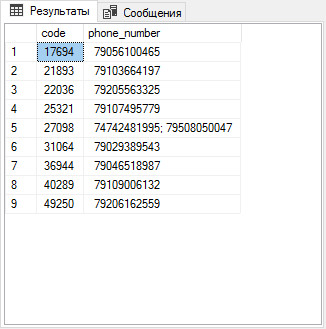

### Получение полной иерархии подразделений

**Документ:**

Предположим, что в нашей системе имеется следующий каталог с подразделениями:  
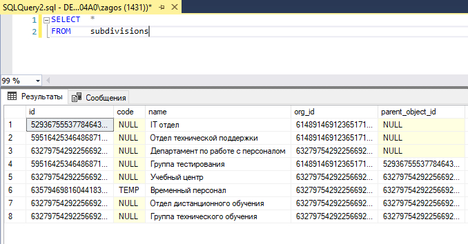

В панели администратора это выглядит так:  
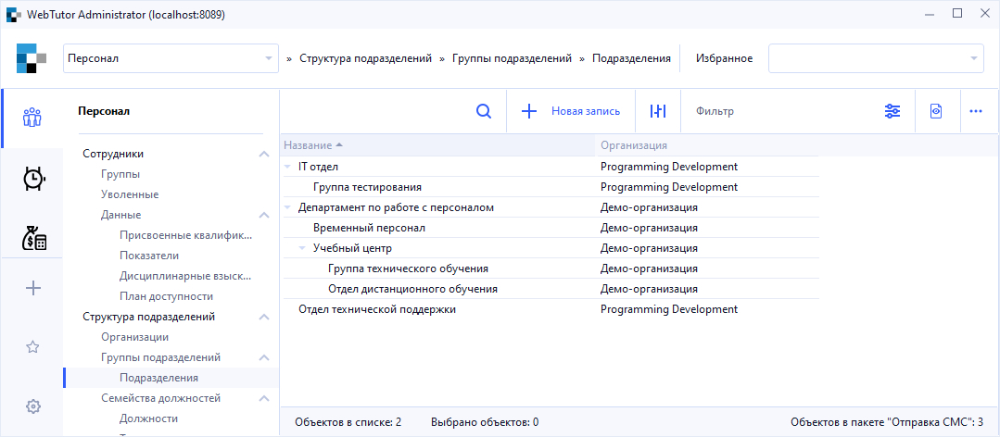

**Запрос:**
```sql
WITH tree (  id -- ИД подразделения
            ,name -- Наименование подразделения
            ,pathstr -- строка для сборки иерархии
          ) 
AS (
    SELECT  id
            ,name
            ,CAST(name AS VARCHAR(MAX))
    FROM    subdivisions
    WHERE   parent_object_id IS NULL

    UNION ALL

    SELECT  S.id
            ,S.name
            ,t.pathstr + '/'+ S.name -- присоединяем следующее подразделение через делиметр
    FROM    subdivisions S INNER JOIN tree T ON T.id = S.parent_object_id
)

SELECT  id
        ,pathstr
        ,CAST('<M>' + REPLACE(pathstr, '/', '</M><M>') + '</M>' AS XML) AS pathstrXML -- выводим путь в XML виде для удобства работы с их частями
FROM    tree
```

**Результат:**  
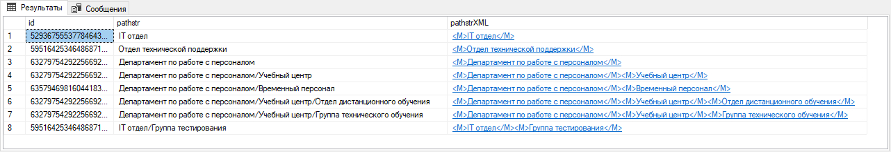

На рисунке мы получили полный путь до подразделения, составленный из наименований родительских подразделений. Дополнительный столбец `pathstrXML` - это искусственно созданный столбец для удобства последующих работ. Например, чтобы получить список всех дочерних подразделений для `IT отдел`.  
Обратите внимание на разделитель, в нашем случае это `/`, в некоторых случаях его понадобится заменить на собственные, если в названиях подразделений символ `/` является частью названия.  
Так же запрос выполнится с ошибкой, если в названиях подразделений присутствуют символы `>`, `<`, `&`. Ошибка проявляется при попытке собрать XML из названий подразделений, чтобы обойти эту ошибку, эти символы следует заменить на HTML-представление (`&` -> `&amp;`).

### Получение иерархии подразделений вниз, начиная с конкретного подразделения

Предположим, что нам необходимо получить список всех дочерних подразделений для "Учебный Центр" включая себя:  
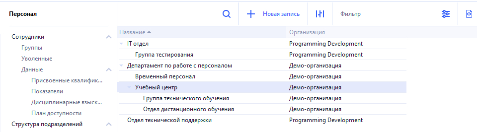

**Запрос:**
```sql
-- Указываем ИД нужного подразделения
DECLARE @sub_id bigint = 6327975429225669223;

-- Рекурсией собираем список всех дочерних подразделений
WITH tree (id) AS (
SELECT  id
FROM    [subdivisions]
WHERE   id = @sub_id
UNION ALL
SELECT  V.id
FROM    [subdivisions] V INNER JOIN tree t ON t.id = V.parent_object_id)

-- Выводим подразделения
SELECT   A.id
FROM	tree A
```

**Результат:**  


### Получаем список подразделений по иерархии вверх, включая само подразделение

Предположим, что нам нужно быстро получить список подразделений из штатного расписания сотрудника. В запросе мы будем указывать ИД подразделения "Группа Технического обслуживания", где находится наш сотрудник:  


**Запрос:**
```sql
WITH tree (id, name, parent_object_id, level) AS (
    SELECT   A.id
            ,A.name
            ,A.parent_object_id 
            ,1 -- начальный уровень иерархии
    FROM    subdivisions A 
    WHERE   A.id = 6327975429225669225 -- указываем ИД нужного подразделения
    
    UNION ALL 
    
    SELECT   A.id
            ,A.name
            ,A.parent_object_id
            ,B.level + 1
    FROM    subdivisions A INNER JOIN tree B ON A.id = B.parent_object_id
) 

SELECT  A.*
        ,(SELECT MAX(level) from tree) - A.level + (SELECT MIN(level) from tree) AS reverse_level
FROM    tree A
```

**Результат:**  
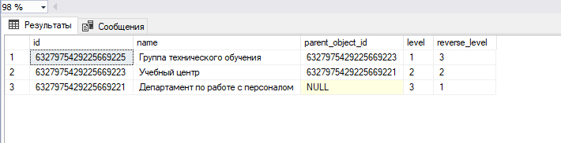

### Получаем значения XML узлов и собираем в строку через разделитель

Предположим, что нам понадобилось отправить на "клиент" все совершенные действия над заявкой. Нужные нам данные находятся в карточке заявки на вкладке "Документооборот" в разделе "История вызова действий":
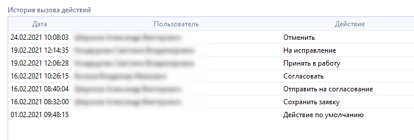

XML структура выглядит следующим образом (лишние узлы удалены):
```xml
<request>
    <id>0x6017A42E7D874F79</id>
    <code>ir1188556</code>
    <request_type_id>0x5DD3E62241FA382E</request_type_id>
    <status_id>ignore</status_id>
  <workflow_log_entrys>
    <workflow_log_entry>
      <create_date>2021-02-01T09:48:15+00:00</create_date>
      <action_id>dafault_action</action_id>
    </workflow_log_entry>
    <workflow_log_entry>
      <create_date>2021-02-16T08:32:00+00:00</create_date>
      <action_id>save_request</action_id>
    </workflow_log_entry>
    <workflow_log_entry>
      <create_date>2021-02-16T08:40:04+00:00</create_date>
      <action_id>send_to_agree</action_id>
    </workflow_log_entry>
    <workflow_log_entry>
      <create_date>2021-02-16T10:26:15+00:00</create_date>
      <action_id>agree</action_id>
    </workflow_log_entry>
    <workflow_log_entry>
      <create_date>2021-02-19T12:06:28+00:00</create_date>
      <action_id>accept_in_work</action_id>
    </workflow_log_entry>
    <workflow_log_entry>
      <create_date>2021-02-19T12:14:35+00:00</create_date>
      <action_id>by_edit</action_id>
    </workflow_log_entry>
    <workflow_log_entry>
      <create_date>2021-02-24T10:08:03+00:00</create_date>
      <action_id>cansel_request</action_id>
    </workflow_log_entry>
  </workflow_log_entrys>
</request>
```

**Запрос:**

```sql
SELECT   id
        ,A.data.query('for $elem in request/workflow_log_entrys/workflow_log_entry/action_id return <s>{concat($elem, ";")}</s>').value('.', 'varchar(max)')
FROM    request A
```

**Результат**

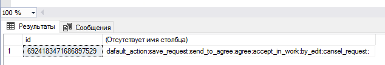
